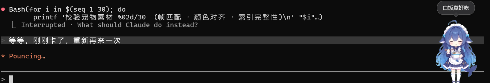
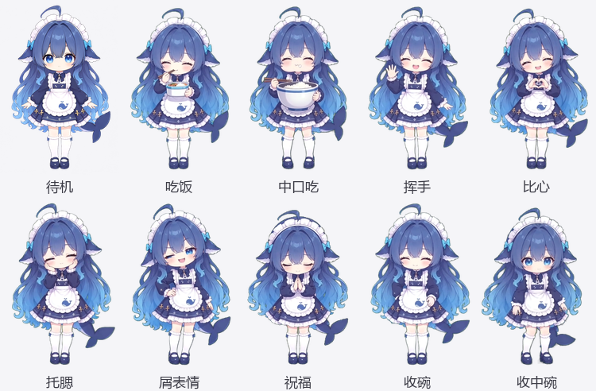

# 鲸鱼娘桌宠


一只会跟着你干活的鲸鱼娘桌宠，同一个角色的两个平台版本：**Claude Code（PetPet 桌宠）** 和 **dsh（DshDesktop）**。

她不是那种只会原地晃两下的桌宠 —— 你发消息她捧着碗一口一口吃，这一轮干完她收碗，偶尔双手合十给你祝福，你按 Esc 打断她，她会停下手里的事甩你一个屑表情，点她会挥手/比心。

**English**: a desktop pet that reacts to your AI coding session. Same character, two builds: **Claude Code** ([PetPet](https://github.com/stshourenxy-dev/petpet-playbook)) and **dsh**. She eats from a bowl while you work, puts it away when the turn ends, and gives you a smug look if you hit Esc to interrupt. On **Windows** you can grab the [green build](https://github.com/wei125775-lab/whalegirl-deskpet/releases/latest), unzip it and double-click `启动.cmd`.



*实拍：左边是 Claude Code 正在跑任务，右边就是她——干活期间一直端着碗吃，气泡是她自己弹的。*



*上图是她的十个动作，全部实拍自宠物素材。*


*挥手 → 起子代理时脚边游出一只小海豚，绕着她转一圈再沉下去。上面这段是 6 秒循环（436×640 原尺寸，[15 秒完整版](docs/preview/showcase.mp4)还含比心、吃饭、收碗和屑表情）。*

## 她什么时候做什么

| 你做什么 | Claude Code 版 | dsh 版 |
|---|---|---|
| 你发消息 / 模型开始干活 | 捧着碗吃（循环）；**10% 的轮次换成端着中碗、拿筷子正经吃一顿** | 捧着碗吃（循环，全程一条轨道，见坑五） |
| 这一轮结束 | 收碗 → 55% 托腮发呆 / **10% 双手合十祝福** / 35% 待机 | **native 同左**（靠 `transitions.json`）；legacy 直接回待机（粘性 phase 的限制，见坑一） |
| **按 Esc 打断她** | 立刻停下手里的动作，甩你一个屑表情 | 工具失败/本轮出错时同样甩屑表情 |
| 点她 | 挥手（**8% 换成屑表情**） | 57% 挥手 / 20% 托腮 / 15% 比心 / **8% 屑表情** |
| **起子代理** | 收碗 → 脚边游出一只小海豚转圈 → 跑完沉下去 | 同左（**靠打补丁，见「看鲸鱼」一节**） |
| 什么都不做 | 老实待机——长发和尾巴轻轻晃，偶尔眨眼 | 同左 |


*上面这段就是宠物里真实的待机循环（24 帧 @12fps）：呼吸、飘发、眨眼都是程序化烘焙的，不是抽帧——AI 画不出这种幅度的小动作。其余动作由 AI 视频转序列帧、再逐帧抠像配准，工具链在 [whalegirl-pet-kit](https://github.com/wei125775-lab/whalegirl-pet-kit)。*

## 装

**最省事：下 [绿色版](https://github.com/wei125775-lab/whalegirl-deskpet/releases/latest)** —— Windows x64，解压后双击 `启动.cmd` 就有她。不用装 Node、不用 clone 源码、不用编译。代价是包大（200MB，整个 Electron 运行时都在里面）。

> ⚠️ **双击时可能弹「Windows 已保护你的电脑」**——点「更多信息」→「仍要运行」即可，不是文件坏了。浏览器下载的 zip 会被打上「来自 Internet」标记，解压时传给里面的文件，Windows 对没签名的程序都会拦这一次。**交给 AI 装的话它可以帮你把这行去掉**（见下面的「给 AI 的一句话」）。

绿色版就是下面「Claude Code 版」预先构建好的成品；想自己构建，或者要用 dsh 版，走这两条：

| 版本 | 给谁用 | 怎么装 |
|---|---|---|
| **Claude Code 版** | [PetPet](https://github.com/stshourenxy-dev/petpet-playbook) 桌宠，跟 Claude Code 联动的那只 | `node claude/install.mjs` → 按它打印的收尾。详见 [`claude/README.md`](claude/README.md) |
| **dsh 版** | [dsh](https://www.npmjs.com/package/@deepseek-ai/dsh)（桌面外壳 DshDesktop）里那只 | 双击根目录的 `install.cmd`（或 `node install.mjs`）→ 重启 dsh。渲染器没装的话**脚本会自己检测并装上** |

> 说明：dsh 版的渲染器是**另一个插件**（[`@linxin666/dsh-pet`](https://www.npmjs.com/package/@linxin666/dsh-pet)），本包只管把素材放好、把她画出来的是它。安装脚本会先看它有没有、没有就调 `dsh plugin add` 装上（顺带把 bundle 登记好、并给它的相位白名单打上看鲸鱼要用的补丁）——**不想让它动你的插件环境就加 `--no-renderer`**。
>
> 自动装失败也不会坏：素材已经就位，脚本会在收尾给出可直接复制的命令，装完重启即可、**不用重跑本脚本**。装渲染器之前界面上什么都不会出现，这是分工决定的，不是坏了。

两个安装脚本都是**幂等**的：会自己找/下依赖，改配置前先备份，重复跑不会出问题；都能加 `--dry-run` 先看它会改什么。

**给 AI 的一句话**（把仓库链接和下面这段一起发给你用的 AI）：

> 「帮我装鲸鱼娘桌宠（<仓库链接>）。
>
> **要 Claude Code 那只**：走绿色版 —— 从 `releases/latest` 下 `whalegirl-petpet-win-x64.zip`，解压到一个固定目录（别在压缩包里直接点）。**解压完先跑这行**，去掉「来自 Internet」标记，不然双击会弹 Windows 拦截框：
> `powershell -NoProfile -Command "Get-ChildItem '<解压目录>' -Recurse -File | Unblock-File"`
> 然后跑 `<解压目录>\claude\install.mjs --hooks-only --pet-exe "<解压目录>\PetPet.exe"`（先加 `--dry-run` 看一眼）——挂上钩子她才会跟着我干活。脚本在解压出来的包里带着，不用联网。
>
> **要 dsh 那只**：跑根目录的 `install.mjs`。
>
> 都一样：先 `--dry-run` 看一眼，按脚本最后打印的收尾，做完告诉我一声重启。」

## 仓库里都有什么

```
pet/            dsh 版素材 + manifest（frames2d 格式）
lib/ · install.mjs · install.cmd      dsh 版插件：把 pet/ 释放给 dsh-pet
claude/         Claude Code 版：宠物包（petpack）+ 一键安装 + viewer 补丁 + 钩子脚本
docs/preview/   README 用的预览图
```

两个版本用的是同一批动作素材，只是打包格式不同：Claude 版是**精灵表 + pet.json v3**（PetPet 框架），dsh 版是**逐帧 PNG + manifest v2**（`@linxin666/dsh-pet` 插件）。

> ⚠️ **素材全部由 AI 生成** —— 立绘经 [see-through](https://github.com/ModelsLab/see-through) 分层，动作由豆包图生视频抽帧。拿去做别的事情之前，先确认所用平台的服务条款：不同平台对生成内容的商用和再分发规定不一样。代码部分是 MIT（见 [LICENSE](LICENSE)）。

---

# dsh 版细节

装完在宠物选择里叫**鲸鱼娘**（id `whalegirl-hd`）。

## 装 / 卸

**双击 `install.cmd`**（或 `node install.mjs`），它做三件事：

1. 把包复制到 `<DSH_HOME>/profiles/<profile>/node_modules/@wei125775-lab/whalegirl-deskpet/`
2. 在 profile 的 `package.json` 里加 `dependencies` 和 `dsh.profile.bundles` 条目
3. 备份改之前的 manifest 到 `package.json.bak-whalegirl`

然后**重启 dsh**（自建的 DshDesktop 或官方桌面版）。插件本身不注册任何东西，只在启动时把包内的 `pet/` 释放到 `<DSH_HOME>/pets/whalegirl-hd/` —— dsh-pet 的 `frames2d` 宠物只能从那个目录扫出来（它内联 manifest 的通道只认 v1 sprite2d 精灵表，喂 frames2d 进去会静默降级，而 sprite2d 只有固定 9 个 Codex 动画名，装不下这些自定义动作）。

释放是幂等的：目标目录的内容和包内一致就跳过。比的是**内容**不是版本号——改了 `pet/` 里的任何东西（素材、`pet.json`、`voice.json`）都不用手动删目录，下次启动发现对不上就会重建；部署目录被拷坏（缺帧、拷到一半）也是同样处理，会自己修好。想强制覆盖就删掉 `<DSH_HOME>/pets/whalegirl-hd/` 再重启。**宠物没出现就再重启一次**——插件释放和 dsh-pet 扫目录都发生在启动期间，安装脚本已经把 bundle 排在 `@linxin666/dsh-pet` 前面，但万一顺序还是反了，第二次必然正确。

卸：删掉上面那三处（`node_modules` 里的包、profile `package.json` 的条目、`<DSH_HOME>/pets/whalegirl-hd/`）。

## 给对方装

整个文件夹拷过去（zip / 网盘 / clone 都行），对方双击 `install.cmd` 或跑 `node install.mjs`，重启 dsh。对方那边需要：

- **dsh** ≥ 0.1.5-rc.1（插件走 `dsh.bundle.patch` 机制）
- **[`@linxin666/dsh-pet`](https://www.npmjs.com/package/@linxin666/dsh-pet)** —— 没装的话宠物会照常释放到目录里，但没有任何东西渲染它；脚本会警告一句。先 `dsh plugin add @linxin666/dsh-pet`
- **node**（dsh 本身就依赖它）

安装脚本自己会找地方：`--dsh-home=<目录>` > `DSH_HOME` 环境变量 > `~/.dsh`。profile 优先挑装了 `dsh-pet` 的那个，找不到退回 `web`；**有多个装了 `dsh-pet` 的 profile 时它不会猜**，会报出来让你用 `--profile=<名字>` 指定（挑错的代价是改了另一个 profile 的 bundles）。

**渲染器版本必须跟着目标 profile 的 dsh 走**，所以 `--renderer-spec=` 是刚需：

| 目标 | dsh | 渲染器 spec |
|---|---|---|
| 自建 DshDesktop / `dsh web` | 0.1.5-rc.x | `@linxin666/dsh-pet@0.3.23` |
| 官方桌面版 | 0.1.7-rc.x | `@linxin666/dsh-pet@0.4.2` |

dsh-pet 0.4.2 的 peerDeps 是 `dsh >=0.1.7-rc.1`，装上 0.1.5 的 profile 会直接坏掉；不传 `--renderer-spec` 时脚本按不带版本号装（= 装最新），**只适合全新环境**。

## 官方桌面版（Electron 那版）

桌面版有自己的数据目录（`DSH_HOME`）和自己的 profile，叫 `desktop`。**它走自研引擎**：这个 profile 里不装 `@linxin666/dsh-pet`，`lib/engine/` 直接从包目录读素材、自己投影相位、自己画。所以安装只要一句：

```bash
node install.mjs --profile=desktop --dsh-home=D:\dsh-desktop-home --no-renderer
```

`--no-renderer` 就是这个意思 —— **这个 profile 不需要 dsh-pet**，脚本也不会再去提示你装它（装了两只同时画在屏幕上）。

启动：

```bat
set "DSH_HOME=D:\dsh-desktop-home"
start "" "D:\DeepSeekHarness\DeepSeek Harness.exe"
```

注意安装器给桌面版建的快捷方式指向 exe 本体、**不带 `DSH_HOME`**，双击它会用默认的 `~/.dsh` —— 指向启动脚本才走隔离目录。

### 两条路径：入口自己判定，不用配

| | legacy | native |
|---|---|---|
| 什么时候走 | profile 里**有** dsh-pet | profile 里**没有** dsh-pet |
| 素材 | 「释放」到 `$DSH_HOME/pets/` | 直接从包目录读 |
| 相位 | 改 dsh-pet 的白名单 | 自己定义，不碰第三方 |
| 看鲸鱼 | 包一层它的 `applyActivity` | 自己的管线，天然不被打断 |
| 需要 dsh-pet | 是 | 否 |

启动日志会打一行 `引擎：legacy` 或 `引擎：native`，**不静默切换**。想强制可以给插件行加 `config: { engine: 'native' }`，但装了 dsh-pet 又强走 native 会被拒绝并回退（两个引擎会同时画两只宠物）。

### 排查「宠物没出现」

引擎自带一个诊断接口，先看它再猜：

```bash
curl http://127.0.0.1:19387/api/whalegirl/diagnostics
# {"hits":{"beacon":1,"pet":1,"state":182,"frame":24,"touch":0,"config":0},...}
```

- `beacon: 0` → 浏览器半端**压根没进页面**（`dsh.client` 没被扫到，或 `exports['./client']` 解析不出来）
- `beacon` 有、`pet: 0` → 进来了但挂载失败
- 三个都在涨、`frame` 也涨 → 引擎是好的，问题在显示层（被别的窗口盖住、或位置在视口外）

这个接口是上一次排查"她怎么不出现"留下的：当时从外面看只有"右下角空的"一种症状，而它背后可能是完全不同的三种毛病。

## 干完活收碗（`putaway`）与动作链（`transitions.json`）

一轮跑完（phase 变 `done`）她会**把手里的碗收掉**再回待机。**这条只在 native 引擎（官方桌面版）上有**，声明写在 `pet/transitions.json` 的保留键 `$phases` 里，engine 载入时并进相位表：

```json
{
  "$phases": { "done": "putaway" },
  "putaway": { "touchface": 55, "bless": 10, "idle": 35 },
  "bless": { "idle": 100 }
}
```

`$phases` 是"相位 → 轨名"的补丁，用来放**在 `pet.json` 里写不得的映射**。为什么 `done → putaway` 写不得：`done` 是粘性相位，dsh-pet 客户端在点击动作释放时会按当前相位重新解析一次，映射到一次性动作就变成**每点她一次重播一遍收碗**（坑一那条规则）。`pet.json` 是两条路共用的，所以它保持 `done: "idle"`。

收碗之后接什么，是 `transitions.json` 的另外那些键，按权重掷。键是"播完之后要挑下一段"的那条轨，值是 `{目标轨: 权重}`（**权重，不是概率，不要求和为 1**）。没写这条轨、或掷到的目标不存在，就走它自己的 `fallback`（缺省待机）。链上走过的轨不会重复走（`A→B→A` 走到重复就落 `fallback`），所以不会打转。

**为什么这些都要放同级文件**：dsh-pet 对 track 的字段是白名单 + fail-closed（只认 `frames` / `frameMs` / `loop` / `fallback`），多一个字段就是 `diag.error`、**整只宠物被丢掉**。而 `pet.json` 还要给 legacy（dsh-pet）那条路用，所以扩展只能放它不认的文件里 —— 跟 `voice.json` 同一个套路。键名带 `$` 前缀的是保留指令（轨道名走 `/^[a-z0-9][a-z0-9-]*$/`，撞不上）。

两条实现上的注意（改这块之前先看）：

1. **同一次里，同一条一次性轨只认一次。** 收碗 875ms 播完，客户端按 `fallback` 自己落回待机，而服务端在这个相位里还会继续说"该播 putaway" —— 400ms 一次的轮询会把收碗**一遍遍重播**。
   判据是 `/state` 里的 **`seq`**（状态机每收一个新相位就 +1），**不是相位名**：`done`/`failed` 允许重复提交（重新计时），第二轮结束时相位名还是 `done`，只看名字会把第二次收碗静默吞掉 —— 触发条件是客户端错过了中间那些相位，而窗口最小化时它本来就不轮询。
2. **动作链只在相位驱动时掷，点击动作不掷**：点击有 `override` 和释放定时器，插进来两边会打架。

## 她的台词（`pet/voice.json`）

> ⚠️ **native 引擎（官方桌面版）这一批还没接台词** —— 气泡和 `voice.json` 都还没做，她在那边的动作、点击、看鲸鱼都有，就是不说话。下面这套目前只在 legacy 下生效。

dsh-pet 把会话事件投影成 phase，**同时也会投影出一句台词**冒在气泡里。台词默认来自官方内置文案（"准备开始""正在思考""爬取中"…）—— 那不是鲸鱼娘在说话。所以她在 dsh 里的话由 `pet/voice.json` 提供。

**`voice` 不能写进 `pet.json`** —— manifest v2 的顶层白名单里没有这个字段。它是一个**跟 `pet.json` 平级的独立文件**，放在宠物目录里就会被读走（`scanPetDir` 里 `loadVoicePackFile(join(entryDir, "voice.json"))`）。宠物被释放到 `~/.dsh/pets/<id>/` 时会一起带过去。

能配四块：

| 字段 | 覆盖什么 | 允许的键 |
|---|---|---|
| `status` | 各 phase 的状态台词 | `prepare` `waiting` `thinking` `review` `toolResult` `done` `failed` `toolFailed` `maxTokens` `interrupted` `blocked` |
| `tools` | 按工具类别出词 | `read` `write` `edit` `shell` `grep` `find` `ls` `webSearch` `webFetch` `mcp` `memory` `subagent` `todo` `browser` `git` `ask` `generic` |
| `toolRemaining` | 还有几个工具在跑 | 可用占位符 `{n}` |
| `whispers` | 干活期间的碎碎念（分类 9 秒、结果 5 秒节流） | `categories`：`thinking` `writing` `reading` `editing` `running` `searching` `git` `delegating` `browsing` `generic`；`results`：`pass` `fail` `done` |

另外 `panel`（面板标签）、`remarks`、`ranks` 也能覆盖，本宠物没用。

**占位符按块白名单校验**：`tools` 只认 `{tool}` 和 `{hint}`，`toolRemaining` 只认 `{n}`，`status` 一个都不认（写了会被丢掉并记一条 warning）。单行 ≤160 字，单池 ≤64 条。写错不会崩 —— 整包解析失败只是被忽略，**降级回官方文案**，所以 `voice.json` 是低风险改动。

想确认改动生效、又不想起 dsh：`loadPetRegistry` 的 `warnings` 应当为空，且 `reg.byId('<id>').voice.overrides` 里能看到你的池子。链路是 `voicePools()` = `mergeVoicePacks(globalVoice, entry.voice).overrides` → `emptyProjectionRuntime(pools)` → `new StatusVoice(pools)` / `new WhisperEngine(pools)`。

## 看鲸鱼（子代理来了，脚边游出一只小海豚）

起子代理的时候，她会收碗、脚边游出一只小海豚转圈，等子代理跑完，海豚沉下去，她回去吃饭。

**这一块是三层非官方机制搭出来的，dsh-pet 一升级就可能失效，所以单独写清楚。**

### 它靠什么跑起来

1. **给 dsh-pet 的相位白名单打补丁。** `frames2d.phases` 是 fail-closed 校验的 —— 写进去不认识的名字（`unknown activity phase`）会让**整只宠物被静默丢弃**，界面上直接没有她。所以要往 dsh-pet 的 `PET_ACTIVITY_PHASES` 里补 `whale-in / whale-loop / whale-out`，补丁落在两个文件：`lib/index.js`（服务端那份，实际校验走它）和 `lib/types/manifest-v2.js`。
   脚本是 `patch-dshpet.mjs`（`install.mjs` 会自动调它），幂等，`--dry-run` 可预览。
2. **相位是"偷渡"过去的。** `pet` 服务上的 `applyActivity()` 内部直接 `machine.onActivityStatus(input)`，**不校验相位**；相位原样流到客户端，而客户端的 `trackForPhase` 只是查 `config.phases[phase]` 这张表。所以只要表里挂得上键就能播。
3. **演出期间吞掉子代理的事件。** dsh-pet 对子代理会话**没有任何过滤** —— 子代理自己的 `tool/call` 之类会 `applyActivity` 到自己身上并抢走 `displaySession`，不处理的话鲸鱼每被子代理的一次工具调用打断就**从头重播一遍**。所以插件把 `applyActivity` 包了一层，演出期间只吞来源是子代理会话的调用，主会话照常放行。

### dsh-pet 升级之后怎么办

补丁会被冲掉。**宠物不会消失** —— 插件里的 `syncWhalePhases()` 会在 dsh-pet 读 manifest 之前，先探一下它认不认那几个相位（读主文件里有没有 `"whale-in"` 字面量）：不认就把相位键从部署的 manifest 里摘掉，降级成"没有看鲸鱼"的版本，并在日志里喊一声。

**它是双向的** —— 这一点是有意设计的：`releasePet()` 只在包内版本比已装的新时才覆盖，所以"没装 dsh-pet 时先装了本包（相位被摘）→ 之后才装 dsh-pet 并打上补丁"这条路上，被摘掉的相位没人会加回来。`syncWhalePhases()` 检测到补丁在了就把相位补回去，所以**先装哪个都行，不用重装**。

恢复：`node patch-dshpet.mjs`，然后重启 DshDesktop。

### 不要了怎么关

把 `pet/pet.json` 里 `frames2d.phases` 的 `whale-in / whale-loop / whale-out` 三个键删掉就行，补丁留着无害（白名单只是放行，多几个名字不影响别的宠物）。插件会因为你没声明那几个相位而不启动演出。

## phase 映射

dsh-pet 把会话事件投影成 7 个 phase，宠物按 phase 播动作：

| phase | 什么时候 | 播什么 |
|---|---|---|
| `idle` | 没有会话活动 / 一轮被中止 | 待机（循环） |
| `waiting` | 你发出消息、每步开始 | 吃饭 |
| `thinking` | 模型在推理 | 吃饭 |
| `tool` | 工具调用中 | 吃饭 |
| `review` | 模型在输出回复 | 吃饭 |
| `done` | 一轮完成 | 待机 |
| `failed` | 工具失败 / 本轮出错 | 屑表情（播一遍回待机） |

改这些就是改 `pet/pet.json` 里的 `frames2d.phases` 和 `gameplay.touch.zones`，两个都是 dsh-pet 的 manifest v2 字段，**改了要重启 dsh**（宠物是启动时扫的）。

### 四个踩过的坑，改 manifest 前先看

**一、`done` 和 `failed` 是粘性 phase，映射到它们的 track 必须是循环动作或者 idle。**

`phase` 只在收到新事件时才变 —— dsh-pet 里只有 sprite2d 走的 `animation` 字段带 2.4 秒回落窗口，frames2d 直接吃 `phases[phase]`，没有回落。而 track 默认 `loop: true`。所以映射**循环动作**会一直播到你下次发消息（一开始配的 `done → 比心` 就是这样，比心循环个没完）；映射**一次性动作**则每次点击后都会补播一次（点击是"占住 override + 定时释放"，释放时重新按当前 phase 解析，那会儿 phase 多半还粘在 `done` 上）。

所以 `done` 只能映射 `idle`。想在 dsh 里表达"干完活"这类一次性动作，只能挂到 `gameplay.touch` 上。

> **native 引擎（官方桌面版）现在能让 `done` 播收碗**，靠的是 `pet/transitions.json` 里那个保留键 `$phases`（native 载入时并进相位表）—— **不是**把 `pet.json` 的 `done` 改掉。因为 `pet.json` 是两条路共用的，一旦在那里写成 `done: putaway`，legacy 那边每次点她都会重播一遍收碗（这条规则上面刚写过）。同一个文件要伺候两个宿主时，能写进共用文件的只有两边都成立的映射。

`failed → 屑表情` 是这条规则的有意例外：屑表情是**一次性** track（`loop: false` + `fallback: idle`），那 30 帧是"抬手/眨眼 → 保持得意表情 → 收回"的完整表情动作，循环播会变成反复眨眼。代价是出错后那个窗口里点她一下会补播一次屑表情——补的正是当前 phase 该有的动作，看着还算连贯，就接受了。（之前这里挂的是托腮，换成屑表情是因为**表情类素材在宠物尺寸下读得出来**，比肢体动作更贴"被打断了"的语境；托腮现在只做点击反应。）

**二、一次性动作的 `stateMs` 必须等于素材总时长（帧数 × 帧长）。**

点击分支的 `stateMs` 是"占住 override 多久"，**不写时默认 3000ms**（`gameplay-hud.tsx` 里 `result.stateMs ?? 3000`），不是素材时长。它和素材对不上就会切在动作中段：比素材长 → 循环动作**多播小半遍**再被切走（托腮原来配 3200ms、素材只有 2490ms，于是"做完之后手又抬了一次"，就是被这个问题坑的）；比素材短 → 一次性动作被**砍掉尾巴**。

所以四个点击分支的 `stateMs` 都按各自素材的帧数 × 83ms 对齐、再多留一帧（剪完死帧后：挥手 23 帧 → 1992、托腮 27 → 2324、比心 27 → 2324、屑表情 27 → 2324）。**剪了素材的帧就必须回来改这里**，否则就退回"多播一截"。多留的那一帧是防定时器抖动：`stateMs` 比素材短会把一次性动作砍掉尾巴。

**三、frames2d 没有 pingpong。**

petpet 那边靠 `pingpong` 往返播放解决"素材首尾接不上"，dsh 这边没有。所以吃饭那 7 帧在 manifest 里是**手工展开成 12 格往返序列**的（`f01..f07, f06..f02`）。同一个文件名可以重复引用，客户端按 URL 缓存，不会重复解码。

> **这个数组就是"剪死帧"的存放处，两条路都认**（native 引擎 2026-09-26 之前只列目录、把它整份丢掉了，见坑七）。所以 `frames` 里写了什么、屏幕上就播什么 —— 改这里的帧数**必须**同步改点击分支的 `stateMs`（坑二），两处差一帧就会两头切错位置。

**四、轨道名不许有下划线，单轨最多 64 帧。**

- 轨道名走 `/^[a-z0-9][a-z0-9-]*$/`，**下划线不合法**（叫 `eat_mid` 会让整条轨道被拒）；`frames` 里的必须是**相对该轨道自己目录**的纯文件名（写成 `eat/f01.png` 这种带路径的会被当缺帧逐个丢掉）
- 单轨 `frames` 最多 **64** 条。超限是**整只宠物被静默丢弃**、界面上直接没有她，所以"端碗吃 N 轮之后换成中口吃"这种长循环写不出来。想改只能动 dsh-pet 的 `FRAMES2D_MAX_FRAMES`（`src/manifest-v2.ts` 与编译产物 `lib/` 各一处，改完会被下次升级覆盖）

**五、同一段工作里别给不同 phase 映射不同轨道。**

每次 phase 变化，只要映射到的轨道名和当前的不一样，就从**第 0 帧重播**（`renderers/frames2d.ts`：订阅里 `if (target !== track) play(target)`，而 `play()` 第一件事就是 `frameIndex = 0`）。

而一轮里 `tool` 和 `thinking` 是**交替**出现的 —— `tool/call` → tool，`tool/result` → thinking，`reasoning-delta` → thinking。所以这两者映射到不同轨道时，**每调用一次工具就会重播两次**。原来 `thinking → 中口吃` 就是这么坏的：一轮十几个工具调用，等于二十几次"把碗放下又端起来"，看起来极乱。

修法是把 `waiting / thinking / tool / review` 全部映射到同一条 `eat`，一轮里轨道只在开头和结尾各切一次。（中口吃素材还在 `pet/frames/eat-mid/`，轨道也保留着，只是现在没人引用。）

**六、phase 映射没有概率，而 `idleDirector` 在这版里是死的。**

带随机的只有四处：点击分支 `branches[].probability`、待机导演 `idleDirector.acts[].weight`、打工 `work.successProbability`、商店 `shop.lottery`。想要"某个 phase 按概率换动作"，manifest 表达不了。

`idleDirector` 本来是最像"闲着时小概率做个动作"的机制，但它的守卫是 `phaseRef.current !== 'idle'`，而 `phase` 是粘性的（见坑一）——正常跑完一轮后永久停在 `done`，只有"一轮被中止"或"会话被 dispose"才会回到 `idle`。官方自带的四只宠物也没有一只用它（`grep idleDirector assets/*/pet.json` 全空）。所以别指望它。

**七、素材首尾自带"动作之外"的帧，要剪。**

`build_video.py` 是 `np.linspace(0, total-1, n)` 均匀抽帧，抽出来的窗口是按"整条视频"切的，**不是按动作边界切的**。所以每条轨道的开头/结尾都挂着动作之外的帧：开头是她还没起手的站桩（点了之后先愣一下），结尾是动作做完后的站桩、有时候还混进**下一段动作的开头几帧**。

实测（`eat` 那条最严重）：

- `eat`：源视频第 63~84 帧（约 0.9 秒）她本身就是定住的，抽中的 5 帧全是这段；而窗口取到第 91 帧，**把下一口的起手也切了进来**。循环里 38% 是死气。
- `wave`：30 帧里开头 3 帧 + 末尾 4 帧是站桩，占 30%。
- `touchface` / `smug` / `putaway` / `heart`：各有 2~3 帧。

**剪法**：直接改 `frames` 数组（文件不用删，留着方便回退）。`eat` 因为是手工展开的往返序列，剪完要重新补上回程。`putaway` 有 `frameMs` 数组，**剪 `frames` 必须同步剪 `frameMs`**，长度不等会让整只宠物被静默丢弃。

> native 引擎（官方桌面版）**也认这个数组** —— 2026-09-26 之前它只列目录、把剪好的序列整份丢掉（`eat` 的往返没了、38% 死气回来了；`wave` 从还没起手的 f01 开始播，而点击的 `stateMs` 是按剪后帧数配的，两头都切错）。现在**帧序列这一块**两条路语义一致：声明了就用声明，省略才列目录。（"相位怎么映射"那部分两边仍有意不同，见坑一和 `transitions.json` 那节。）

判断"哪几帧是多余的"用逐帧相邻差：取整条轨道的相邻差中位数，**低于它 35% 的连续首/尾段就是死帧**。注意区分"死帧"和"有意的保持"——`smug`（保持得意表情）、`touchface`（托住）、`heart`（红心成型后停一拍）中间那些小差异是动作本身，别剪。

**八、所有动作都在以约 2 倍速播放。**

`build_video.py` 从 121 帧 @24fps（5.04 秒）的视频里均匀抽 30 帧 = 每 4.03 帧抽一张（等效 6fps），而播放是 12fps → **整个动作 2.02 倍速**。每一条 30 帧的动作都如此。

这是设计时就这样的（12fps 是精灵动画的常规速率），一直没人抱怨；但如果哪天觉得"动作太急"，先把这条对上。想改就加轨道级的 `frameMs` 数组（`KNOWN_FRAMES2D_TRACK` 允许 `frames`/`frameMs`/`loop`/`fallback`），把 83 调成约 166。`eat` 因为往返播放，前向速度本来就和源视频接近，改速要连 `eat-mid` 一起改，否则两种吃法会一快一慢。

---

# 素材与授权

`pet/` 和 `claude/whalegirl.petpack` 里的素材全部由 AI 生成：立绘经 [see-through](https://github.com/ModelsLab/see-through) 分层，动作由豆包图生视频再抽帧。**要用在自己的项目里，请先确认对应平台的服务条款**——不同平台对生成内容的商用和再分发规定不一样。

脚本部分 MIT。
